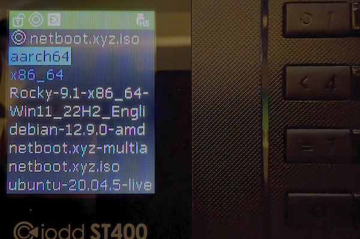

### Burning a CD/DVD

To create a bootable CD-ROM/DVD, burn the ISO image [netboot.xyz.iso](https://boot.netboot.xyz/ipxe/netboot.xyz.iso) to a blank CD-ROM/DVD.  Insert the media into the server, set the proper boot order and boot up.

### Virtual Machine Software

You can also use these ISOs to boot any sort of VM in Citrix XenServer, Proxmox VE, VMware ESXi, VMware Fusion, VirtualBox.

### Out of Band Virtual Media

The netboot.xyz ISO can be attached to remote virtual media of a server like the Dell DRAC or HP iLOs.  Because the iPXE boot disk is so light weight, it is great for starting installations where there might be really low bandwidth as it will only stream the files needed for the installation.

### USB Bootable Virtual Media

If you need to store a collection of ISOs, including netboot.xyz, on a single USB drive, there are some recommended devices that work well with netboot.xyz. You can copy multiple ISOs to the drive and mount them as a Virtual Disk during the boot process. This is useful not only for using netboot.xyz but also for other ISOs like Windows, Proxmox, or other media. It is a great way to have a portable collection of bootable media always ready to go!

Recommended tools include:

* [IODD ST400](https://amzn.to/42vm2By)
* [IODD Mini USB 3.0 256-bit Secure Encrypted SSD Drive](https://amzn.to/4haXpOZ)
