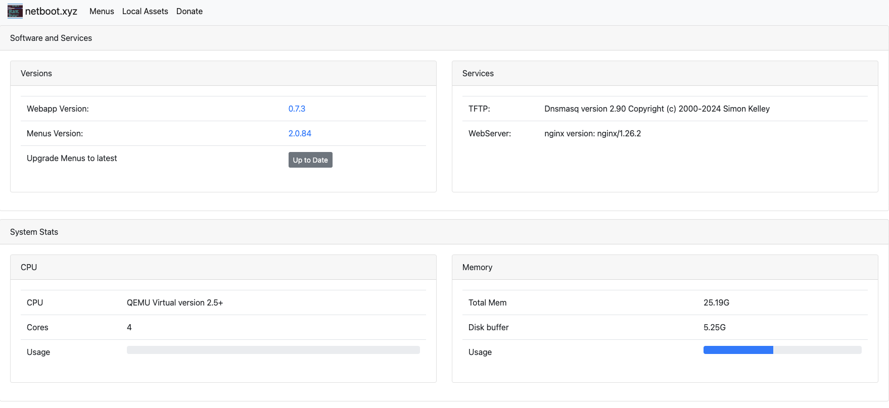

The [netboot.xyz Docker image](https://github.com/netbootxyz/docker-netbootxyz) allows you to easily set up a local instance of netboot.xyz. The container is a small helper application written in node.js. It provides a simple web interface for editing menus on the fly, retrieving the latest menu release of netboot.xyz, and enables mirroring the downloadable assets from Github to your location machine for faster booting of assets.


It is a great tool for developing and testing custom changes to the menus. If you have a machine without an optical drive that cannot boot from USB then having a local netboot server provides a way to install an OS. If you are looking to get started with netboot.xyz and don't want to manage iPXE menus, you should use the boot media instead of setting up a container.

The container is built upon Alpine Linux and contains several components:

* netboot.xyz [webapp](https://github.com/netbootxyz/webapp)
* nginx for hosting local assets from the container
* dnsmasq for providing TFTP services
* syslog for providing tftp activity logs

Services are managed in the container by [supervisord](http://supervisord.org/).

The container runs under both x86_64 and ARM based architectures.

## How it Works

The following diagram details the flow of how netboot.xyz serves content to a client and how it works when the Docker container is used:

import Tabs from '@theme/Tabs';
import TabItem from '@theme/TabItem';

<Tabs>

  <TabItem value="lr-diag" label="Left Right" default>
  ```mermaid
  graph LR
      A[Client Computer] -->|PXE Boot Request| B{netboot.xyz container?}
      B -- Yes --> C[netboot.xyz container]
      C -- Local request --> D[Serve netboot.xyz]
      C -- Unavailable --> E[boot.netboot.xyz]
      B -- No --> E
      E -->|Internet Request| F[boot.netboot.xyz]
      F --> G[Serve netboot.xyz]
      G --> H[Client Boots OS]
      D --> H
  ```
  </TabItem>
  <TabItem value="td-diag" label="Top Down">
  ```mermaid
  graph TD
      A[Client Computer] -->|PXE Boot Request| B{netboot.xyz container?}
      B -- Yes --> C[netboot.xyz container]
      C -- Local request --> D[Serve netboot.xyz]
      C -- Unavailable --> E[boot.netboot.xyz]
      B -- No --> E
      E -->|Internet Request| F[boot.netboot.xyz]
      F --> G[Serve netboot.xyz]
      G --> H[Client Boots OS]
      D --> H
  ```
  </TabItem>
</Tabs>
